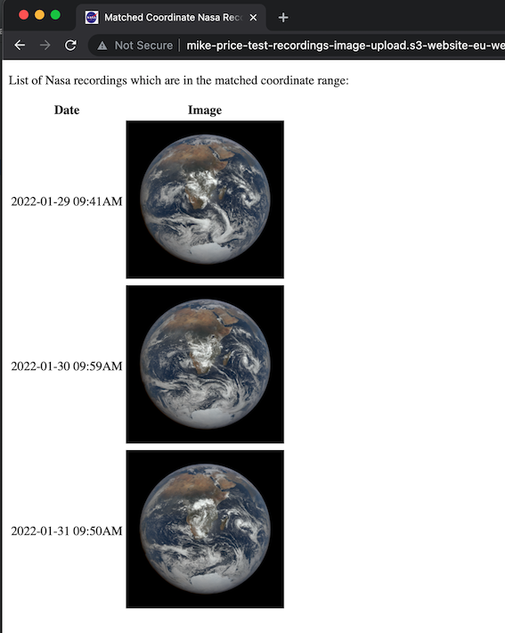

# nasa-epic-project

This is a personal L&D project based on the [NASA DSCOVR: EPIC](https://epic.gsfc.nasa.gov/) project to further my understanding of GoLang interacting with AWS and API based services.

## What it does

A Lambda is triggered nightly via an EventBridge cron schedule and scrapes an API which is published by Nasa containing satellite imagery of the earth. If the earth co-ordinates of any imagery match those configured via an envar then the image is uploaded to S3 and meta-data written to DynamodDB. The S3 objects are stored in a publicly available static hosted website which are presented via a dynamically generated HTML site index. At the end of each run if there have been any co-ordinate matches then an HTML report is generated and emailed via SES. If any results are already in the database then no further processing is performed (uploading/emailing etc.)



## Development
```shell
# Generate the config TOML file interactively first. This is a one time local task
sam deploy --guided

# Subsequent deploys
make deploy_sam_stack

# Cleanup stack
make delete_sam_stack

# Cleanup S3 and DynamoDB items. Useful whilst invoking the lambda manually
make delete_all_items
```

See [SAM CLI Template](./template.yaml) for configurable settings via the Lambda envars section